# Yet Another LuCI app

<div align="center">
  
  <h2>Modern OpenWrt & LuCI Router Manager for Mobile</h2>
  <p>Maintained by <b>Tuhin Garai (@nightcodex7)</b></p>

  [](https://flutter.dev)
  [](https://dart.dev)
  [](LICENSE)
  []()
  [](https://openwrt.org)

  <br><br>

  <h3>Dashboard Preview (Light & Dark Theme)</h3>
  <p>
    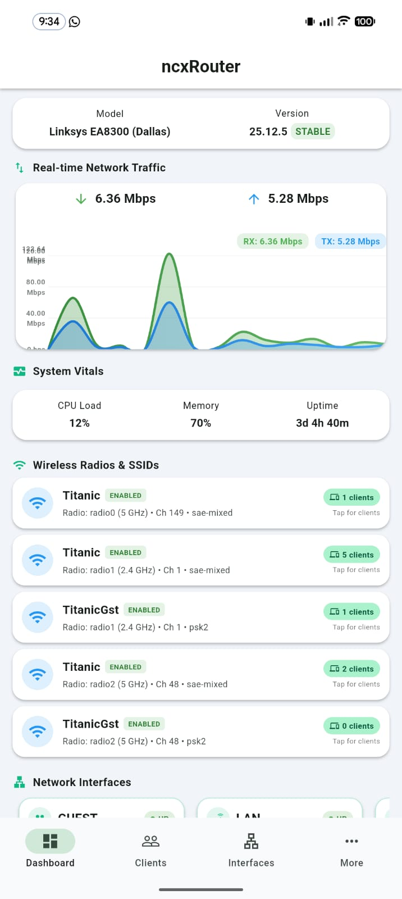
    &nbsp;&nbsp;&nbsp;&nbsp;
    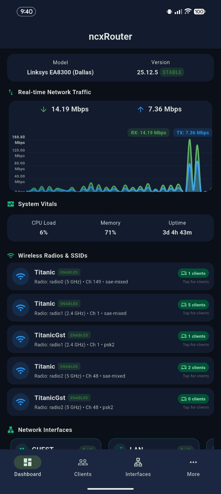
  </p>
</div>

<br>

**Yet Another LuCI app** is a modern, high-performance Flutter mobile application for managing, monitoring, and diagnosing OpenWrt routers. Built with Material 3 design principles, custom micro-animations, and full LuCI RPC integration, it brings desktop-class router control directly to your mobile phone.

---

## 🌟 Key Features

### 📡 Multi-Router Management & Secure Vault
- **Multi-Device Support:** Switch between unlimited OpenWrt routers with isolated secure credentials.
- **HTTPS & Custom Ports:** Connect via HTTP/HTTPS with support for self-signed SSL certificates.

### 📊 Real-Time Dashboard & Network Vitals
- **Dual Themes:** Clean, seamless switching between Light and Dark themes.
- **Animated Vitals Gauges:** Live CPU load, RAM memory usage, Swap, and Storage capacity.
- **Real-Time Throughput Graph:** Smooth live chart displaying network transfer rates (Rx/Tx Kbps/Mbps) with configurable polling intervals.
- **Interface Overview Cards:** Live UP/DOWN statuses, assigned IPv4/IPv6 addresses, MACs, and protocols (DHCP, Static, PPPoE, WWAN).

### 📱 Connected Client Management
- **Unified Connected List:** Synchronous aggregation of active DHCP leases, ARP neighbor entries, and wireless stations.
- **Device Identification:** Displays hostname (prioritizing static leases and DHCP), IP, MAC address, vendor OUI, connected SSID, and radio band badges.
- **Wi-Fi Access Control:** Quick MAC entry tool for access management.

### 📶 Wireless Radios & Station Diagnostics
- **Radio Band Management:** Multi-radio card diagnostic for 2.4GHz, 5GHz, and 6GHz bands.
- **Precise Frequency Info:** Displays operational frequency up to 3 decimal places (e.g. 2.423 GHz), channel, transmit power, and active stations.
- **Station List Modal:** View exact connected client hostnames and signal levels linked per SSID.

### 📦 OPKG & APK Dual Package Manager
- **Smart Engine Detection:** Automatic engine switching between standard `opkg` and OpenWrt 24.10+ `apk` package managers.
- **Package Search & Feed Updates:** Search available repositories, update package lists, install, and remove modules.
- **LuCI App Finder:** Dedicated view for discovering and managing installed vs. available LuCI extensions (`luci-app-*`).

### ⚙️ System Diagnostics & Control
- **Services Management:** View active `procd` daemons and init scripts with live status tracking (Running, Stopped, Enabled, Disabled). Start, stop, restart, enable, or disable services remotely.
- **Cron Job Scheduler:** View custom or system scheduled tasks (`/etc/crontabs/root`).
- **Disk & Filesystems Monitor:** Storage usage breakdown for root `/`, overlay `/overlay`, temporary `/tmp`, and attached USB storage.
- **Preserved Backup File Viewer:** Inspect files preserved during sysupgrade operations (`sysupgrade -l`).
- **MTD Partition Dumper:** Save binary `mtdblock` partition images directly from `/proc/mtd`.
- **Factory Reset Trigger:** Remotely initiate system reset (`firstboot -y`) and router reboot.

---

## 📸 Screenshots Showcase

<div align="center">
  <p><b>Explore full resolution screenshots of Yet Another LuCI app features:</b></p>
</div>

| Login Screen | Dashboard (Light) | Dashboard (Dark) | Connected Clients |
|:---:|:---:|:---:|:---:|
| 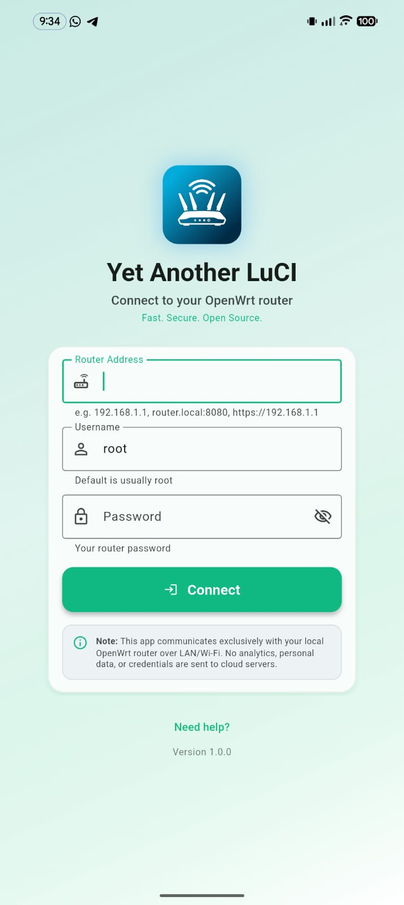 |  |  | 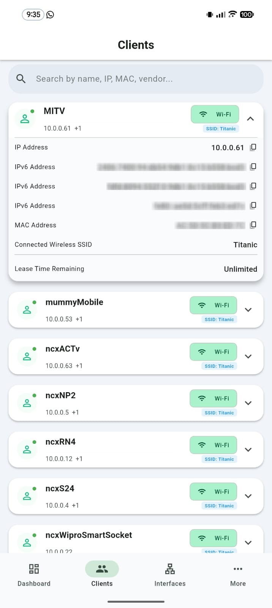 |

| Network Interfaces | Wireless Management | Real-Time Metrics | Services Diagnostics |
|:---:|:---:|:---:|:---:|
| 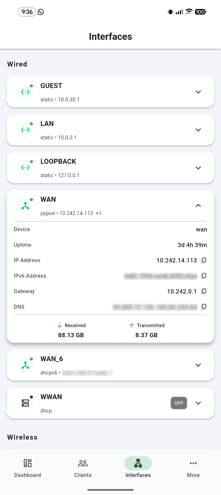 | 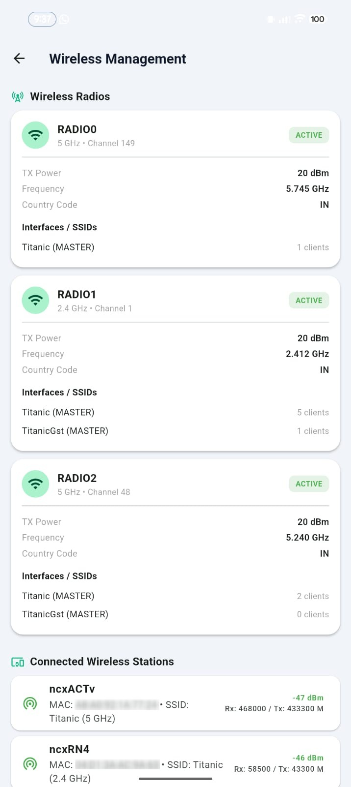 | 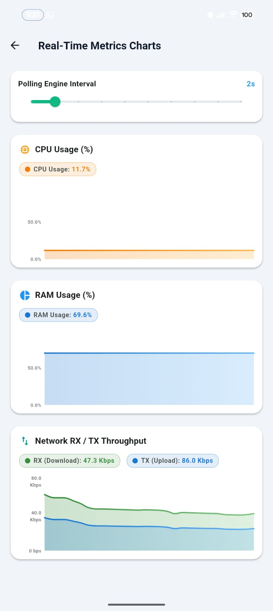 | 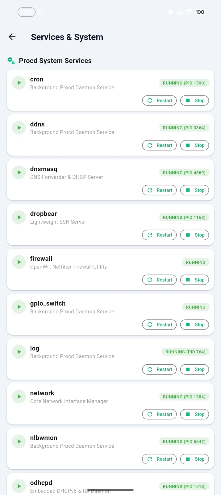 |

| Package Manager | Storage Monitoring | DHCP & DNS Leases | Multi-Router Manager |
|:---:|:---:|:---:|:---:|
| 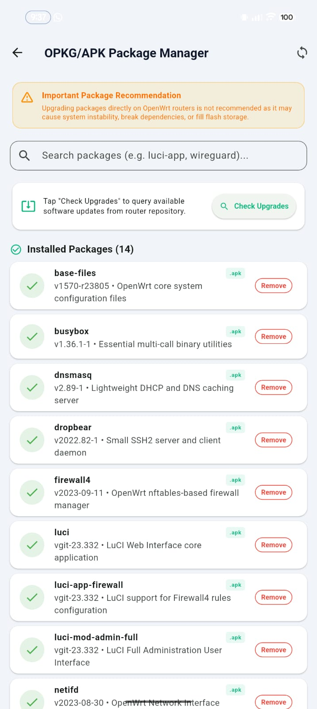 | 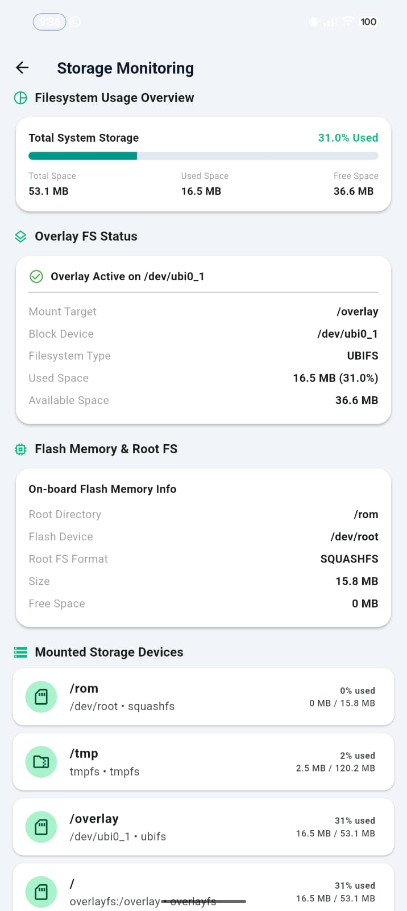 | 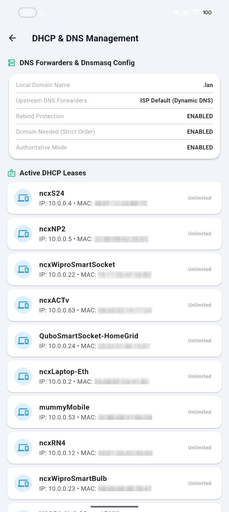 | 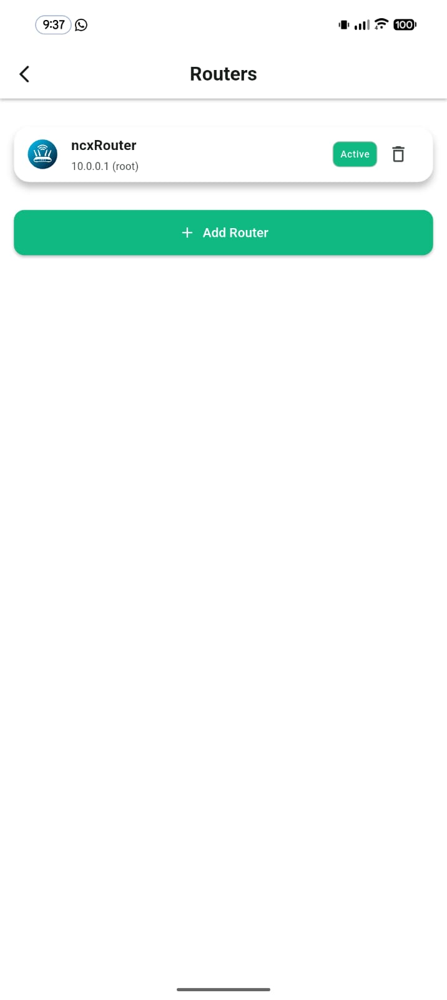 |

<br>

<div align="center">
  <a href="https://github.com/nightcodex7/yet-another-luci-app/tree/main/assets/screenshots">
    
  </a>
  <br>
  <p><i>Click the badge above or navigate to <a href="assets/screenshots/">assets/screenshots/</a> to view the complete collection of screenshots on GitHub.</i></p>
</div>

---

## 📁 Repository Structure

```
yet-another-luci-app/
├── android/                   # Android native platform code & signing configs
├── assets/                    # Static app assets
│   ├── icons/                 # App launcher icons
│   ├── images/                # Brand graphics & logos
│   ├── mock/                  # Mock diagnostic data for review modes
│   └── screenshots/           # Full app feature screenshots & theme previews
├── fastlane/                  # Google Play Store release metadata & screenshots
├── lib/                       # Main Flutter codebase
│   ├── config/                # Design tokens, themes, app routes, and constants
│   ├── models/                # Strongly-typed data models (Client, Interface, Router, etc.)
│   ├── modules/               # Feature modules (Package Manager, System Backup, Services, Cron, Storage)
│   ├── screens/               # Core screens (Dashboard, Clients, Interfaces, Login, Settings)
│   ├── services/              # API communication layer, JSON-RPC client, secure storage
│   ├── state/                 # State management engine (Riverpod AppState)
│   ├── widgets/               # Reusable UI widgets, animated gauges, throughput charts
│   └── main.dart              # Application entry point
├── scripts/                   # Auxiliary maintenance scripts
├── store-badges/              # Google Play Store promotional badges
├── pubspec.yaml               # Flutter package specification & dependencies
├── PRIVACY_POLICY.md          # Full privacy policy disclosure
├── CONTRIBUTING.md            # Guidelines for open-source contributors
└── README.md                  # Project documentation
```

---

## 🛠️ Building & Running

### Prerequisites

- **Flutter SDK:** 3.32.5+
- **Dart SDK:** 3.8+
- **JDK:** OpenJDK 17 or higher
- **Android Studio / Android SDK:** API level 36

### Quick Local Run

```bash
# 1. Clone repository
git clone https://github.com/nightcodex7/yet-another-luci-app.git
cd yet-another-luci-app

# 2. Install dependencies
flutter pub get

# 3. Analyze code quality
flutter analyze

# 4. Run application in dev mode
flutter run
```

---

## 🔐 Router Requirements & Security

To enable full communication between **Yet Another LuCI app** and your OpenWrt router, ensure the following RPC modules are installed on your router:

```bash
opkg update
opkg install luci-mod-rpc rpcd-mod-luci rpcd-mod-iwinfo luci-mod-status
/etc/init.d/rpcd restart
```

### Security Highlights

- **Zero Analytics:** No tracking telemetry, no cloud relays, zero data collection.
- **Local Vault:** Router IP addresses, credentials, and tokens remain isolated on your local device.
- **SSL Support:** Supports HTTPS RPC endpoints and self-signed SSL certificate bypass options.

---

## 🤝 Contributing

Contributions, bug reports, and feature suggestions are welcome! Please read [CONTRIBUTING.md](CONTRIBUTING.md) before submitting pull requests.

1. Fork the project.
2. Create your feature branch (`git checkout -b feature/AmazingFeature`).
3. Commit your changes (`git commit -m 'Add some AmazingFeature'`).
4. Push to the branch (`git push origin feature/AmazingFeature`).
5. Open a Pull Request.

---

## 📜 License & Credits

Distributed under the **GNU General Public License v3.0**. See [`LICENSE`](LICENSE) for details.

### Acknowledgments

- **[cogwheel0/luci-mobile](https://github.com/cogwheel0/luci-mobile)** — Special thanks to [cogwheel0](https://github.com/cogwheel0) for building the initial foundation of `luci-mobile`.
- **OpenWrt Project** — Thanks to the OpenWrt developers and community for creating OpenWrt and `rpcd` / `luci-rpc` interfaces.
- **Flutter Framework** — Built with Flutter and Riverpod for high-performance reactive UI rendering.

---
*Maintained with ❤️ by [Tuhin Garai (@nightcodex7)](https://github.com/nightcodex7)*
